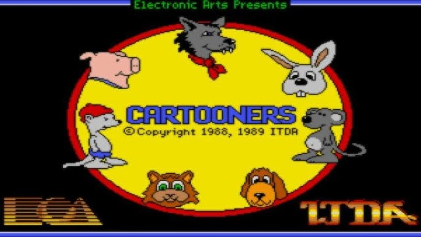

# Strifetooners
[Cartooners](https://www.myabandonware.com/game/cartooners-m7) is an 1988 EA produced cartoon animation system designed to run on EGA era PCs. I was thrilled to discover this software as a kid and would spend hours creating and watching my own animations.

I've recently been learning Vue and decided it would be interesting to put my knowledge into action by building a Cartooners inspired browser based animation editor and playback system.

This builds on earlier work of the Strife static comic editor (Citation needed) and the [Total Strife](https://github.com/MaverickUK/Total-Strife) JavaScript based game engine.

Although Cartooners is a key inspriation, it's more likely that a Macromedia Flash keyframe style of animation will be used.
